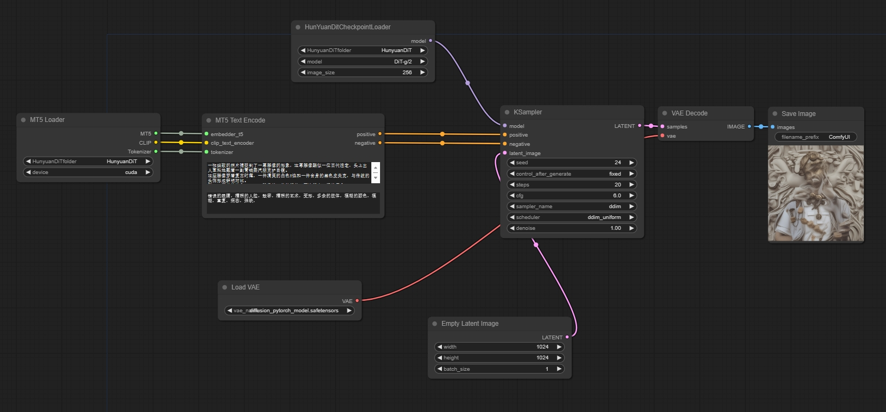

# ComfyUI HunyuanDiT

[HunyuanDiT](https://github.com/Tencent/HunyuanDiT)

```
huggingface-cli download --resume-download Tencent-Hunyuan/HunyuanDiT --local-dir ComfyUI/models/diffusers --local-dir-use-symlinks False
```

sdxl vae

## workflow

[Recommended complete Workflow](https://github.com/chaojie/ComfyUI_ExtraModels/blob/main/HunYuan/wf.json)

