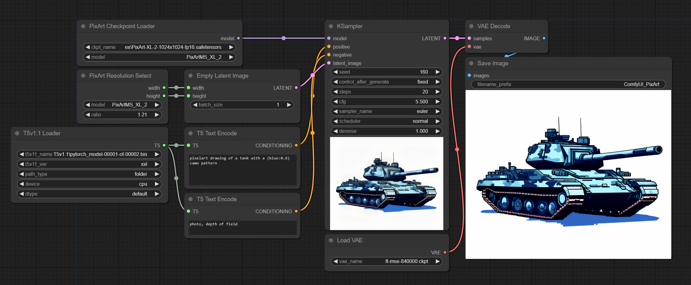
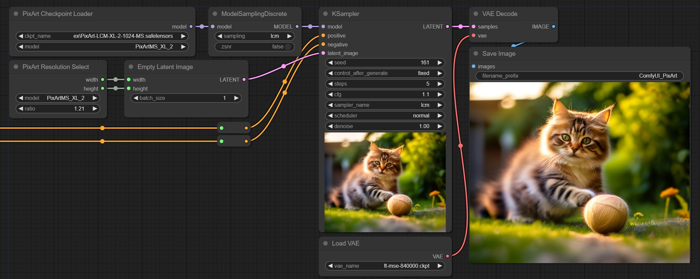
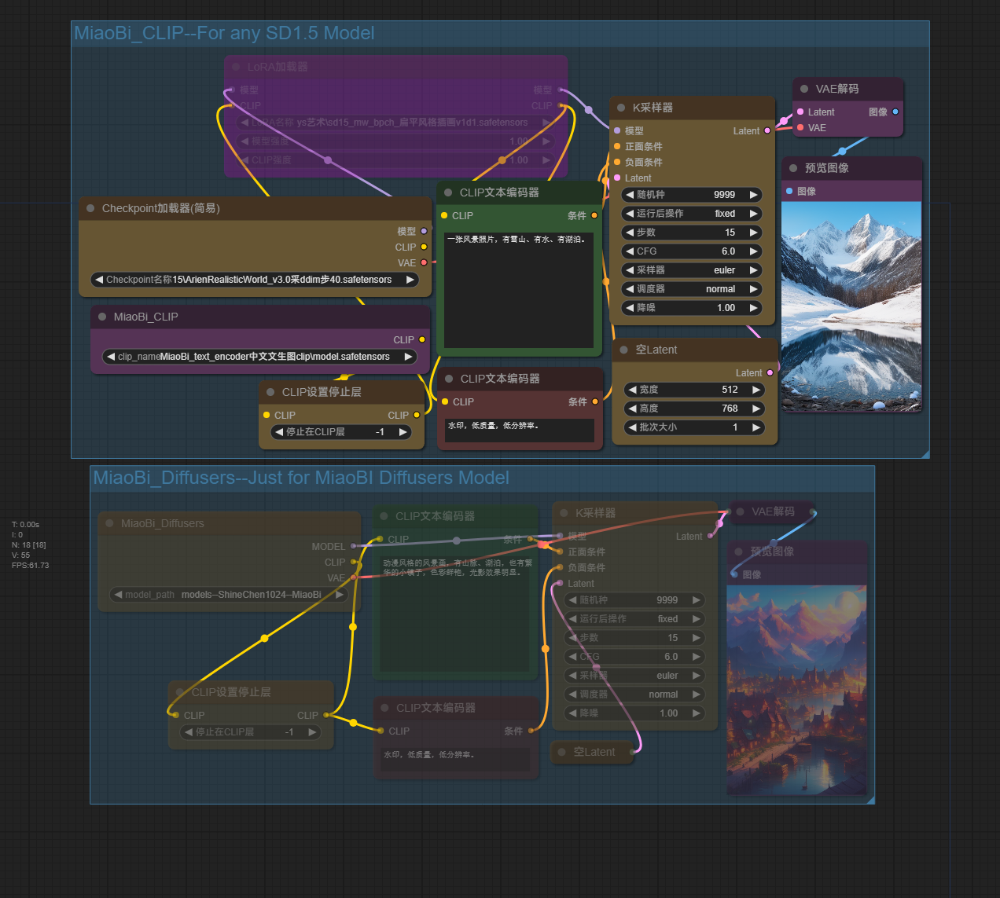

# Extra Models for ComfyUI
This repository aims to add support for various different image diffusion models to ComfyUI.
## Abstract
- 📜[Installation](#installation)
  - 📜[Standalone ComfyUI](#standalone-comfyui)
- 📜[PixArt](#pixart)
  - 🛠[PixArt Usage](#pixart-usage)
- 📜[PixArt Sigma](#pixart-sigma)
- 📜[PixArt LCM](#pixart-lcm)
- 📜[HunYuan DiT](#hunyuan-dit)
  - 🛠[Instructions](#instructions)
- 📜[Dit](#dit)
  - 🛠[Dit Usage](#dit-usage)
- 📜[T5](#t5)
  - 🛠[T5 Usage](#t5-usage)
- 📜[MiaoBi](#miaobi)
- 📜[VAE](#vae)
  - 📜[Consistency Decoder](#consistency-decoder)
  - 📜[Deflickering Decoder & VideoDecoder](#deflickering-decoder-and-videodecoder)
  - 📜[AutoencoderKL & VQModel](#autoencoderkl-and-vqmodel)

## Installation
Simply clone this repo to your custom_nodes folder using the following command:

`git clone https://github.com/city96/ComfyUI_ExtraModels custom_nodes/ComfyUI_ExtraModels`

You will also have to install the requirements from the provided file by running `pip install -r requirements.txt` inside your VENV/conda env. If you downloaded the standalone version of ComfyUI, then follow the steps below.

### Standalone ComfyUI
I haven't tested this completely, so if you know what you're doing, use the regular venv/`git clone` install option when installing ComfyUI.

Go to the where you unpacked `ComfyUI_windows_portable` to (where your run_nvidia_gpu.bat file is) and open a command line window. Press `CTRL+SHIFT+Right click` in an empty space and click "Open PowerShell window here".

Clone the repository to your custom nodes folder, assuming haven't installed in through the manager.

`git clone https://github.com/city96/ComfyUI_ExtraModels .\ComfyUI\custom_nodes\ComfyUI_ExtraModels`

To install the requirements on windows, run these commands in the same window:
```
.\python_embeded\python.exe -s -m pip install -r .\ComfyUI\custom_nodes\ComfyUI_ExtraModels\requirements.txt
.\python_embeded\python.exe -s -m pip install bitsandbytes --prefer-binary --extra-index-url=https://jllllll.github.io/bitsandbytes-windows-webui
```

To update, open the command line window like before and run the following commands:

```
cd .\ComfyUI\custom_nodes\ComfyUI_ExtraModels\
git pull
```

Alternatively, use the manager, assuming it has an update function.

## PixArt
- [Abstract](#abstract)

[Original Repo](https://github.com/PixArt-alpha/PixArt-alpha)

### Model info / implementation
- Uses T5 text encoder instead of clip
- Available in 512 and 1024 versions, needs specific pre-defined resolutions to work correctly
- Same latent space as SD1.5 (works with the SD1.5 VAE)
- Attention needs optimization, images look worse without xformers.

### PixArt Usage
1. Download the model weights from the [PixArt alpha repo](https://huggingface.co/PixArt-alpha/PixArt-alpha/tree/main) - you most likely want the 1024px one - `PixArt-XL-2-1024-MS.pth`
2. Place them in your checkpoints folder
3. Load them with the correct PixArt checkpoint loader
4. **Follow the T5v11 section of this readme** to set up the T5 text encoder

> [!TIP]
> You should be able to use the model with the default KSampler if you're on the latest version of the node.
> In theory, this should allow you to use longer prompts as well as things like doing img2img.

Limitations:
- `PixArt DPM Sampler` requires the negative prompt to be shorter than the positive prompt.
- `PixArt DPM Sampler` can only work with a batch size of 1.
- `PixArt T5 Text Encode` is from the reference implementation, therefore it doesn't support weights. `T5 Text Encode` support weights, but I can't attest to the correctness of the implementation.

> [!IMPORTANT]  
> Installing `xformers` is optional but strongly recommended as torch SDP is only partially implemented, if that.

[Sample workflow here](https://github.com/city96/ComfyUI_ExtraModels/files/13617463/PixArtV3.json)



### PixArt Sigma
- [Abstract](#abstract)

The Sigma models work just like the normal ones. Out of the released checkpoints, the 512, 1024 and 2K one are supported.

You can find the [1024 checkpoint here](https://huggingface.co/PixArt-alpha/PixArt-Sigma/blob/main/PixArt-Sigma-XL-2-1024-MS.pth). Place it in your models folder and **select the appropriate type in the model loader / resolution selection node.**

> [!IMPORTANT]
> Make sure to select an SDXL VAE for PixArt Sigma!

### PixArt LCM
- [Abstract](#abstract)

The LCM model also works if you're on the latest version. To use it:

1. Download the [PixArt LCM model](https://huggingface.co/PixArt-alpha/PixArt-LCM-XL-2-1024-MS/blob/main/transformer/diffusion_pytorch_model.safetensors) and place it in your checkpoints folder.
2. Add a `ModelSamplingDiscrete` node and set "sampling" to "lcm"
3. Adjust the KSampler settings - Set the sampler to "lcm". Your CFG should be fairly low (1.1-1.5), your steps should be around 5.

Everything else can be the same the same as in the example above.




## HunYuan DiT
- [Abstract](#abstract)

WIP implementation of [HunYuan DiT by Tencent](https://github.com/Tencent/HunyuanDiT)

> [!WARNING]
> Only a proof of concept, most things don't work yet and only 1024x1024 is supported.
> 
> The text encoder device/dtype selection also doesn't work.

The initial work on this was done by [chaojie](https://github.com/chaojie) in [this PR](https://github.com/city96/ComfyUI_ExtraModels/pull/37).

### Instructions
- Download the [first text encoder from here](https://huggingface.co/Tencent-Hunyuan/HunyuanDiT/blob/main/t2i/clip_text_encoder/pytorch_model.bin) and place it in `ComfyUI/models/clip` - rename to "chinese-roberta-wwm-ext-large.bin"
- Download the [second text encoder from here](https://huggingface.co/Tencent-Hunyuan/HunyuanDiT/blob/main/t2i/mt5/pytorch_model.bin) and place it in `ComfyUI/models/T5` - rename it to "mT5.bin"
- Download the [model file from here](https://huggingface.co/Tencent-Hunyuan/HunyuanDiT/blob/main/t2i/model/pytorch_model_module.pt) and place it in `ComfyUI/checkpoints` - rename it to "HunYuanDiT.pt"
- Download/use any SDXL VAE, for example [this one](https://huggingface.co/madebyollin/sdxl-vae-fp16-fix)


## DiT
- [Abstract](#abstract)

[Original Repo](https://github.com/facebookresearch/DiT)

### Model info / implementation
- Uses class labels instead of prompts
- Limited to 256x256 or 512x512 images
- Same latent space as SD1.5 (works with the SD1.5 VAE)
- Works in FP16, but no other optimization

### Dit Usage
1. Download the original model weights from the [DiT Repo](https://github.com/facebookresearch/DiT) or the converted [FP16 safetensor ones from Huggingface](https://huggingface.co/city96/DiT/tree/main).
2. Place them in your checkpoints folder. (You may need to move them if you had them in `ComfyUI\models\dit` before)
3. Load the model and select the class labels as shown in the image below
4. **Make sure to use the Empty label conditioning for the Negative input of the KSampler!**

ConditioningCombine nodes *should* work for combining multiple labels. The area ones don't since the model currently can't handle dynamic input dimensions.

[Sample workflow here](https://github.com/city96/ComfyUI_ExtraModels/files/13619259/DiTV2.json)


## T5
- [Abstract](#abstract)

### T5v11

The model files can be downloaded from the [DeepFloyd/t5-v1_1-xxl](https://huggingface.co/DeepFloyd/t5-v1_1-xxl/tree/main) repository.

You will need to download the following 4 files:
 - `config.json`
 - `pytorch_model-00001-of-00002.bin`
 - `pytorch_model-00002-of-00002.bin`
 - `pytorch_model.bin.index.json`

Place them in your `ComfyUI/models/t5` folder. You can put them in a subfolder called "t5-v1.1-xxl" though it doesn't matter. There are int8 safetensor files in the other DeepFloyd repo, thought they didn't work for me.

For faster loading/smaller file sizes, you may pick one of the following alternative downloads:
- [FP16 converted version](https://huggingface.co/theunlikely/t5-v1_1-xxl-fp16/tree/main) - Same layout as the original, download both safetensor files as well as the `*.index.json` and `config.json` files.
- [BF16 converter version](https://huggingface.co/city96/t5-v1_1-xxl-encoder-bf16/tree/main) - Merged into a single safetensor, only `model.safetensors` (+`config.json` for folder mode) are reqired.

To move T5 to a different drive/folder, do the same as you would when moving checkpoints, but add `    t5: t5` to `extra_model_paths.yaml` and create a directory called "t5" in the alternate path specified in the `base_path` variable.

### T5 Usage
Loaded onto the CPU, it'll use about 22GBs of system RAM. Depending on which weights you use, it might use slightly more during loading.

If you have a second GPU, selecting "cuda:1" as the device will allow you to use it for T5, freeing at least some VRAM/System RAM. Using FP16 as the dtype is recommended.

Loaded in bnb4bit mode, it only takes around 6GB VRAM, making it work with 12GB cards. The only drawback is that it'll constantly stay in VRAM since BitsAndBytes doesn't allow moving the weights to the system RAM temporarily. Switching to a different workflow *should* still release the VRAM as expected. Pascal cards (1080ti, P40) seem to struggle with 4bit. Select "cpu" if you encounter issues.

On windows, you may need a newer version of bitsandbytes for 4bit. Try `python -m pip install bitsandbytes`

> [!IMPORTANT]  
> You may also need to upgrade transformers and install spiece for the tokenizer. `pip install -r requirements.txt`

## MiaoBi
- [Abstract](#abstract)

### Original from: 
- Author: Github [ShineChen1024](https://github.com/ShineChen1024) | Hugging Face [ShineChen1024](https://huggingface.co/ShineChen1024)
- https://github.com/ShineChen1024/MiaoBi
- https://huggingface.co/ShineChen1024/MiaoBi
### Instructions
- Download the [clip model](https://huggingface.co/ShineChen1024/MiaoBi/blob/main/miaobi_beta0.9/text_encoder/model.safetensors) and rename it to "MiaoBi_CLIP.safetensors" or any you like, then place it in **ComfyUI/models/clip**.

这是妙笔的测试版本。妙笔，一个中文文生图模型，与经典的stable-diffusion 1.5版本拥有一致的结构，兼容现有的lora，controlnet，T2I-Adapter等主流插件及其权重。

This is the beta version of MiaoBi, a chinese text-to-image model, following the classical structure of sd-v1.5, compatible with existing mainstream plugins such as Lora, Controlnet, T2I Adapter, etc.

Example Prompts:
- 一只精致的陶瓷猫咪雕像，全身绘有精美的传统花纹，眼睛仿佛会发光。
- 动漫风格的风景画，有山脉、湖泊，也有繁华的小镇子，色彩鲜艳，光影效果明显。
- 极具真实感的复杂农村的老人肖像，黑白。
- 红烧狮子头
- 车水马龙的上海街道，春节，舞龙舞狮。
- 枯藤老树昏鸦，小桥流水人家。水墨画。
- **You can drag it into ComfyUI, it's a png with workflow**


**Limitations**

妙笔的训练数据包含Laion-5B中的中文子集（经过清洗过滤），Midjourney相关的开源
数据（将英文提示词翻译成中文），以及我们收集的一批数十万的caption数据。由于整
个数据集大量缺少成语与古诗词数据，所以对成语与古诗词的理解可能存在偏差，对中
国的名胜地标建筑数据的缺少以及大量的英译中数据，可能会导致出现一些对象的混乱
，如果有以上较高数据质量的伙伴，希望能完善该项目，请与我们联系，我们将根据提
供的数据训练全新的版本。妙笔Beta0.9在8张4090显卡上完成训练，我们正在拓展我们
的机器资源来训练SDXL来获得更优的结果，敬请期待。

Due to limitations in computing power and the size of Chinese datasets, the 
performance of Miaobi may be inferior to commercial models at this stage. We
 are expanding our computing resources and collecting larger scale data, 
looking forward to the future performance of Miaobi.
## VAE
- [Abstract](#abstract)

A few custom VAE models are supported. The option to select a different dtype when loading is also possible, which can be useful for testing/comparisons. You can load the models listed below using the "ExtraVAELoader" node.

**Models like PixArt/DiT do NOT need a special VAE. Unless mentioned, use one of the following as you would with any other model:**
- [VAE for SD1.X, DiT and PixArt alpha](https://huggingface.co/stabilityai/sd-vae-ft-mse-original/blob/main/vae-ft-mse-840000-ema-pruned.safetensors).
- [VAE for SDXL and PixArt sigma](https://huggingface.co/madebyollin/sdxl-vae-fp16-fix/blob/main/diffusion_pytorch_model.safetensors)

### Consistency Decoder
[Original Repo](https://github.com/openai/consistencydecoder)

This now works thanks to the work of @mrsteyk and @madebyollin - [Gist with more info](https://gist.github.com/madebyollin/865fa6a18d9099351ddbdfbe7299ccbf).

- Download the converted safetensor VAE from [this HF repository](https://huggingface.co/mrsteyk/consistency-decoder-sd15/blob/main/stk_consistency_decoder_amalgamated.safetensors). If you downloaded the OpenAI model before, it won't work, as it is a TorchScript file. Feel free to delete it.
- Put the file in your VAE folder
- Load it with the ExtraVAELoader
- Set it to fp16 or bf16 to not run out of VRAM
- Use tiled VAE decode if required

### Deflickering Decoder and VideoDecoder
This is the VAE that comes baked into the [Stable Video Diffusion](https://stability.ai/news/stable-video-diffusion-open-ai-video-model) model.

It doesn't seem particularly good as a normal VAE (color issues, pretty bad with finer details).

Still for completeness sake the code to run it is mostly implemented. To obtain the weights just extract them from the sdv model:

```py
from safetensors.torch import load_file, save_file

pf = "first_stage_model." # Key prefix
sd = load_file("svd_xt.safetensors")
vae = {k.replace(pf, ''):v for k,v in sd.items() if k.startswith(pf)}
save_file(vae, "svd_xt_vae.safetensors")
```

### AutoencoderKL and VQModel
`kl-f4/8/16/32` from the [compvis/latent diffusion repo](https://github.com/CompVis/latent-diffusion/tree/main#pretrained-autoencoding-models).

`vq-f4/8/16` from the taming transformers repo, weights for both vq and kl models available [here](https://ommer-lab.com/files/latent-diffusion/)

`vq-f8` can accepts latents from the SD unet but just like xl with v1 latents, output largely garbage. The rest are completely useless without a matching UNET that uses the correct channel count.


